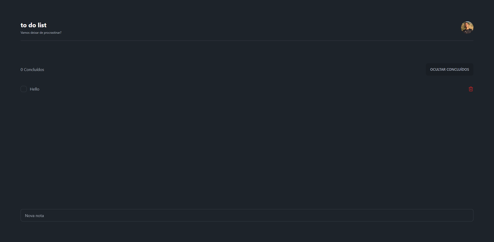

  <a href="#-Technologies">
Technologies</a>&nbsp;&nbsp;&nbsp;|&nbsp;&nbsp;&nbsp;
  <a href="#-Project">Project</a>&nbsp;&nbsp;&nbsp;|&nbsp;&nbsp;&nbsp;
  <a href="#-Layout">Layout</a>&nbsp;&nbsp;&nbsp;

 

## 🚀 Technologies

This project was developed with the following technologies:

- Vue 3 (Composition API)
- TailwindCSS
- DaisyUI
- Axios

## 💻 Project

